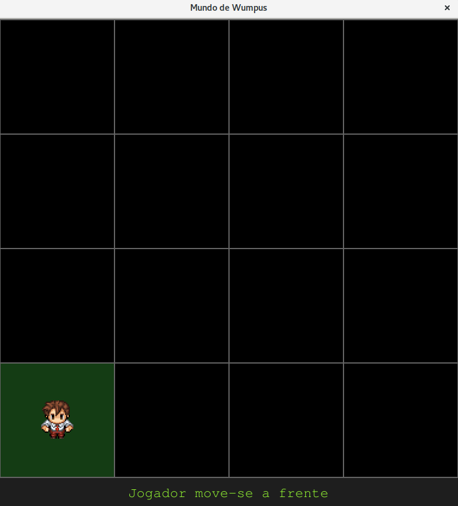
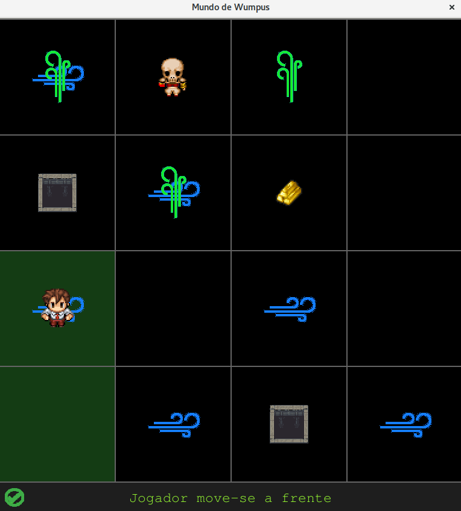

# Sobre o Mundo do Wumpus

**João Victor Canabarro**

**Luiz Guilherme Fonseca Rosa**

## Introdução

O Mundo do Wumpus é um jogo baseado em agentes proposto em 1972 por Gregory Yob, cujo objetivo é encontrar uma peça de ouro em um mapa de dimensões quadradáticas.

O agente, ou caçador, é dotado de percepções como sentir a brisa que emana dos buracos e até mesmo o cheiro do monstro, Wumpus. No mapa, resumindo, existem:

- Buracos, onde o caçador pode cair, levando-o a morte.

- Brisas que emanam dos buracos.

- O monstro Wumpus e seu respectivo cheiro.

- As paredes do mapa.

As regras são:

- Qualquer agente que passar por um buraco, exceto Wumpus, morre.

- O caçador pode se mover casa por casa, uma de cada vez, exceto diagonais.

- O objetivo do caçador é encontrar o ouro sem ser morto pelo Wumpus.


## Implementação

O sistema é implementado em Python 2.7 utilizando as bibliotecas [Pygame](https://www.pygame.org) e [AIMA](https://github.com/aimacode/aima-python).

Basicamente, é gerado um grid 4x4 onde são dispostos, aleatoriamente:

- Um monstro, Wumpus, imóvel e seu respectivo cheiro.

- Buracos e as respectivas brisas.

- Uma peça de ouro.

O agente então pode percorrer o mapa, casa por casa, em busca do ouro, sempre evitando o perigo eminente.

Para isso, o agente percebe a presença ou ausência de determinados fatores, como o cheiro, indicando a proximidade do monstro e a brisa, indicando a proximidade de um buraco. O agente mantém então um histórico de suas percepções, não retornando em locais antes percebidos como inseguros.

```python
    if percept[1] == 2: # Percebeu o ouro
        self.gold_picked = True # Pega o ouro
        self._do(action_list['pick'])
    elif (percept[2] == 2) or (percept[4] == 2): # Caiu em um buraco/Morto pelo Wumpus
        self.alive = False
        ev = event.PlayerDieEvent()
        self.ev_manager.post(ev)
    else:
        c = 0 # contador de percepções
        know = []
        for x in percept: # Percorre a lista de percepções
            if x == 2: # 2 = presente
                know.append("%s%s%s" % (map_list[c], i, j))
            elif x == 0: # 0 = ausente e 1 = desconhecido
                know.append("~%s%s%s" % (map_list[c], i, j))
            c += 1
        if len(know) > 0: # se obteve nova percepção
            print "informa base de conhecimento: ", ' & '.join(know)
            self.kb.tell(expr(' & '.join(know)))

        self._find_safe(i, j) # busca próxima posição segura
```

Deste modo, o agente segue buscando pelas posições seguras, até que por fim perceba estar sobre o ouro ou sobre o Wumpus onde, vence ou morre, respectivamente.

## Comportamentos e Características do Agente

O agente gera três listas em sua base de conhecimento:

- A lista de percepções de todo seu histórico.

- A lista de posições seguras para o próximo passo.

- A lista de percepções da casa atual.

Com base nisso, o agente pode decidir para qual casa avançar. O agente nunca retorna para uma posição que já considerou insegura anteriormente, o que evita qualquer tipo de looping infinito.

Além disso, uma característica curiosa no comportamento do agente é quando nenhum ouro é disposto no mapa. O caçador irá buscar por todo o mapa até cair em um buraco ou morrer pelas mãos do monstro, inevitavelmente.

O agente também tem a possibilidade de matar o monstro, porém apenas quando o Wumpus estiver sobre o ouro ou bloqueando sua passagem até o objetivo final. Fora estes casos, o caçador evitará ao máximo o perigo de morrer pelas mãos do carrasco, indo sempre pelo caminho mais seguro.

## Modos de Jogo

Há dois modos: um passo-a-passo, onde a cada "espaço" do jogador o agente dá o próximo passo e o modo automático, com o qual o agente executa todos os passos diretamente até vencer ou morrer.





## Referências

*Russell, Stuart, and Peter Norvig. "Inteligência Artificial: uma abordagem moderna. Ed." Campus, 2ª Edição. São Paulo, Brazil (2003).*

*Diversos autores. "PyGame". <https://www.pygame.org/docs/> - Acessado em 17 de novembro de 2017.*
