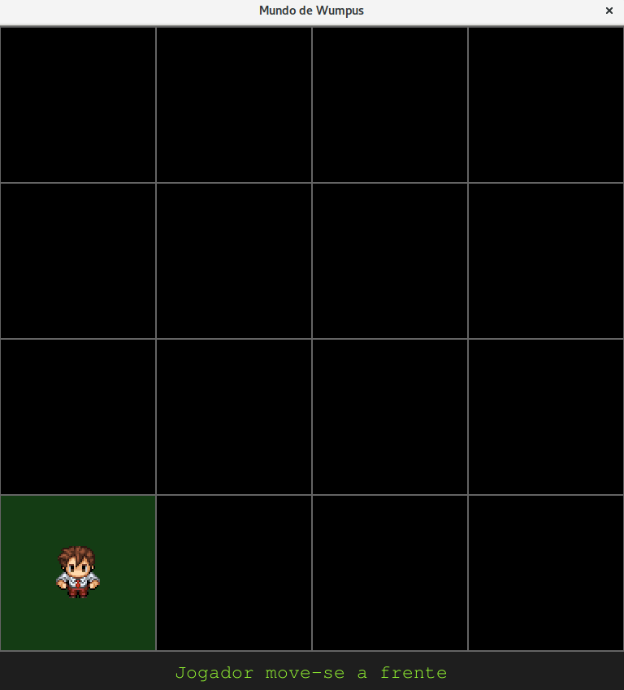
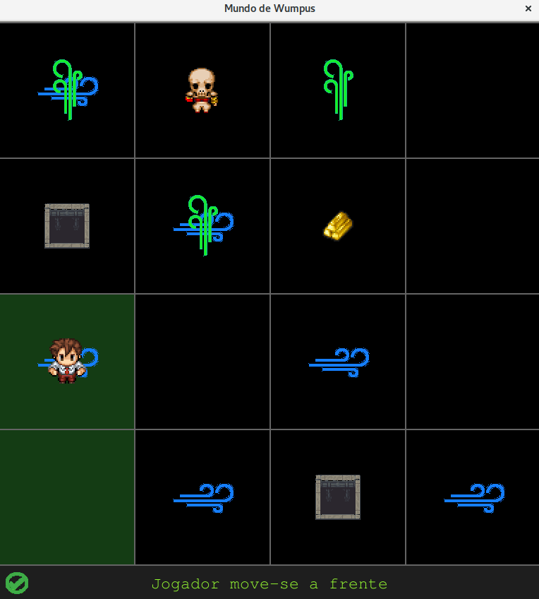
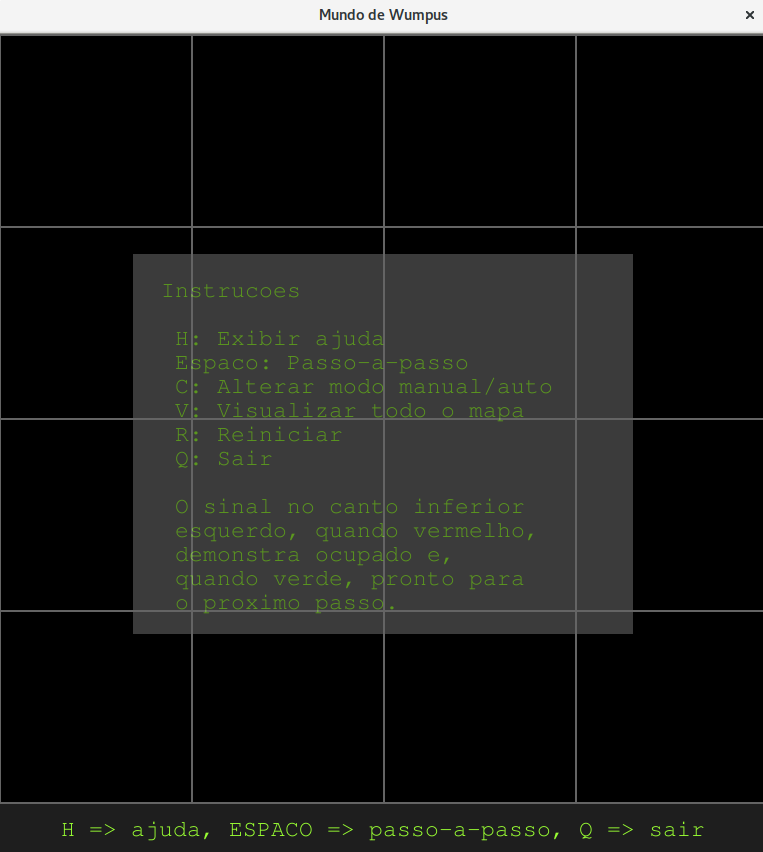

# Mundo de Wumpus

Implementação do Mundo de Wumpus utilizando AIMA e PYGAME.







Requisitos

1. instalar pygame:

```
sudo apt-get update
sudo apt-get install python-pygame
```

2. instalar Tkinter:

```
sudo apt-get update
sudo apt-get install python-tk
```

3. Executar: `python wumpus_world.py`

**Autores**:

João Canabarro <joaovictorcana@gmail.com>

Luiz Rosa <luizguilhermefr@gmail.com>

**Fork** de Wu Zhe <wu@madk.org>.

**Icones** de `https://github.com/thiagodnf/wumpus-world-simulator`